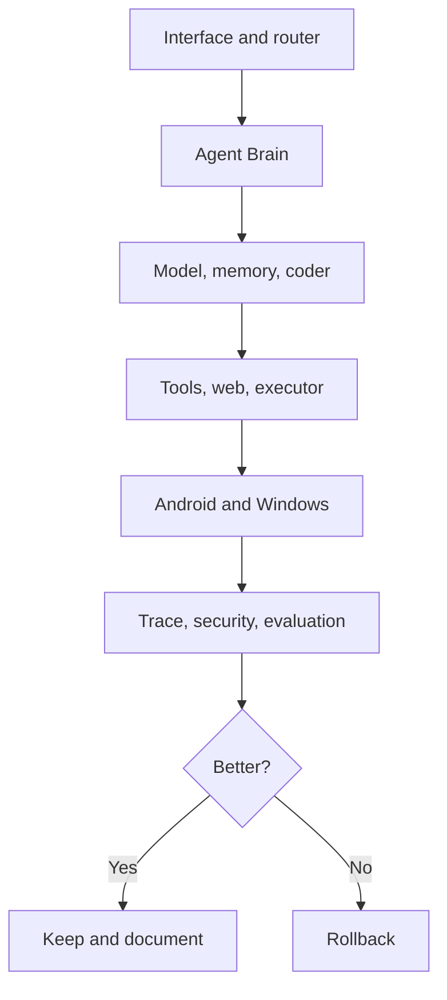

# Thrilla-zilla

> I am building Thrilla-zilla as a phone-first, local-first AI workbench for Android/Termux and Windows. I want one system that can talk, research, understand unfamiliar software, write and repair code, use tools, work with files and data, and improve through testing and rollback. I collected 100 core open-source repositories to study—not to smash together—and this repository is where the clean Thrilla-native system is being built.

The phone-reported donor library is complete: **100/100 core repositories, zero clone failures, approximately 23 GB**. The first three donors in each of ten categories form the priority 30. XTLS/Xray-core is the first verified Phase-2 specialist reference.

The current release is an honest control-plane alpha. It provides the interface, catalog, routing, model connection, local history, diagnostics, and tests needed to build on. It is not yet the autonomous coding/research/tool system described in the long-term plan.

## What I am building toward



## What works in this alpha

- Compact interactive menu with arrow keys and numeric input.
- Cyan user prompts, green Thrilla answers, and distinct success/warning/error colors.
- Automatic request routing: general chat, coding, deep search, files, data, device, or system.
- OpenAI-compatible local-model connection, suitable for `llama-server`.
- Exact catalog of the Phase-1 100, including the priority 30.
- Read-only donor scans, category totals, missing-repo reports, and Git inspection.
- Xray-core registered as the first verified Phase-2 specialist.
- Local conversation history and a separate metadata-only audit log.
- Termux/Android and Windows diagnostics.
- `NO_COLOR`, non-TTY, and forced-color fallbacks.

## What is still needed

- automatic local-model discovery and lifecycle management;
- bounded planning, action, observation, and critic loop;
- structured tools plus safe file, Git, shell, process, and test execution;
- checkpoints and automatic rollback;
- repository/language/build-system intelligence;
- coding and repair agent;
- SQLite memory and source-aware retrieval;
- live, cached, and archived research with citations;
- evaluation, security, benchmarks, and controlled self-improvement;
- Android/Termux and Windows adapters;
- complete target-device verification;
- a duplicate-free Phase-2 specialist library after the core works.

The ordered implementation sequence and the reason for every stage are in [docs/ROADMAP.md](docs/ROADMAP.md).

## Honest boundary

This release labels unavailable capabilities instead of reporting work that did not happen.

The 100 donors are not dependencies and are never imported or executed automatically.

## Install on the phone

From the repository folder in Termux:

```bash
cd "$HOME/Thrilla-zilla"
chmod +x install-termux.sh
./install-termux.sh
thrilla
```

If Python or Git is missing:

```bash
pkg install python git -y
```

You can also run without installing:

```bash
cd "$HOME/Thrilla-zilla"
chmod +x bin/thrilla
./bin/thrilla
```

## Local model

The default endpoint is:

```text
http://127.0.0.1:8080/v1/chat/completions
```

Start an OpenAI-compatible local server such as `llama-server`, then use **Settings → Model URL** if its port differs. Remote model URLs are blocked by default so prompts do not accidentally leave the device. To intentionally use one:

```bash
export THRILLA_ALLOW_REMOTE_MODEL=1
export THRILLA_MODEL_API_KEY='your-token-if-needed'
```

Useful overrides:

```bash
export THRILLA_DONOR_ROOT="$HOME/Thrilla-codebases"
export THRILLA_MODEL_URL="http://127.0.0.1:8080/v1/chat/completions"
export THRILLA_MODEL="local-model"
export THRILLA_COLOR="auto"       # auto, always, never
```

## Commands

```bash
thrilla
thrilla chat
thrilla route debug this Python repository
thrilla donors
thrilla donors --priority
thrilla donors --problems
thrilla doctor
thrilla logs
```

Set `NO_COLOR=1` for plain text. Use `thrilla --color always` when output is being piped but ANSI colors are still wanted.

## Phone font

Thrilla controls color, bold text, spacing, and a compact/expanded layout. The actual glyph typeface belongs to Termux, so Thrilla does not silently overwrite it. To install a Termux font you choose, place a licensed TrueType font at `~/.termux/font.ttf`, then run `termux-reload-settings`. Thrilla still works if the font lacks its optional symbols because status text is also written in words.

## Windows

With Python 3.9 or newer installed:

```powershell
Set-ExecutionPolicy -Scope Process Bypass
.\install-windows.ps1
```

Or run `bin\thrilla.cmd` directly.

## Safety and donor policy

Before any mechanism from a donor enters Thrilla-native code:

1. Identify the exact source and commit.
2. Check its license and compatibility.
3. Document whether the implementation is original, adapted, or copied.
4. Test the mechanism in isolation.
5. Integrate behind a narrow interface.
6. Compare correctness, safety, speed, RAM, CPU, maintainability, and security.
7. Keep measured improvements; roll back regressions.

## Project documentation

- [Canonical project record](docs/PROJECT-RECORD.md)
- [Current status and evidence](docs/STATUS.md)
- [Ordered roadmap](docs/ROADMAP.md)
- [Canonical requirements](docs/REQUIREMENTS.md)
- [Complete donor library](docs/DONOR-LIBRARY.md)
- [Architecture and integration stages](docs/ARCHITECTURE.md)
- [Build verification](BUILD-VERIFICATION.md)
- [Changelog](CHANGELOG.md)
- [Contribution and donor-code rules](CONTRIBUTING.md)
- [Machine-readable project manifest](thrilla-project-manifest.json)

No Thrilla-zilla license has been selected yet. Public visibility does not grant permission to redistribute the code. Every donor retains its own license, which must be checked before direct reuse.

## Development checks

No third-party Python packages are required at runtime or for tests.

```bash
python -m compileall -q thrilla tests
python -m unittest discover -s tests -v
```
